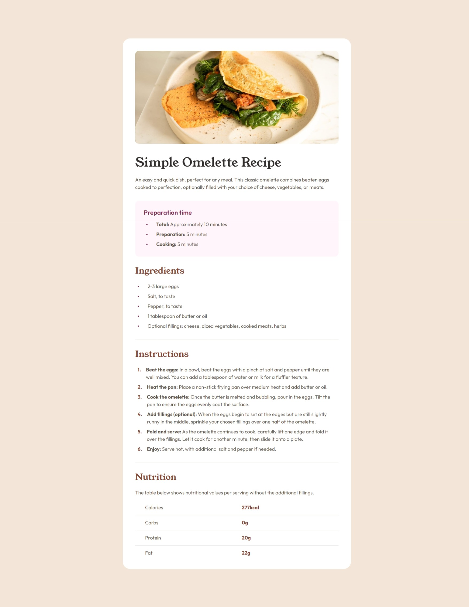

# Frontend Mentor - Recipe page solution

This is a solution to the [Recipe page challenge on Frontend Mentor](https://www.frontendmentor.io/challenges/recipe-page-KiTsR8QQKm). Frontend Mentor challenges help you improve your coding skills by building realistic projects.

### Screenshot

### Links

- Solution URL: [frontendmentor](https://www.frontendmentor.io/solutions/recipe-page-gRvYHrvWdv)
- Live Site URL: [netlify](https://cute-baklava-918709.netlify.app)
